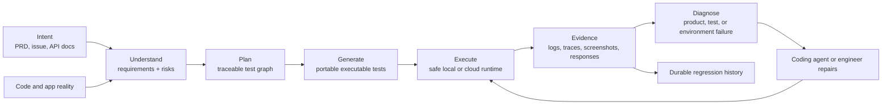
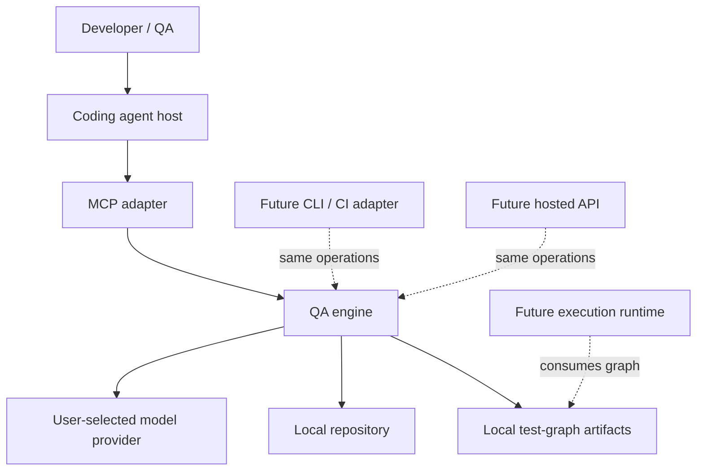
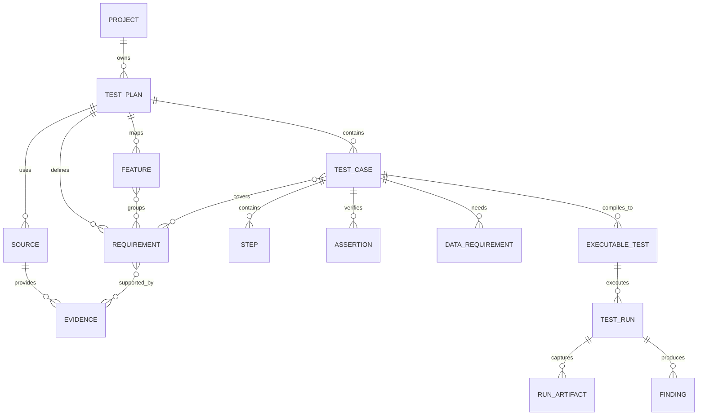
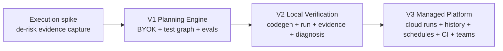

# Verification Intelligence Architecture

Date: 2026-06-14
Status: accepted
Scope: product direction, V1 architecture, and evolution path

## Executive Decision

We are building **verification intelligence for software teams and coding
agents**. MCP is the first adapter, not the product. The product owns specialized
QA reasoning, represents its work as a durable test graph, and eventually closes
the loop with executable verification evidence.

V1 is a local, planning-only product because that is the smallest release that
can prove our reasoning quality. It uses the user's model key (BYOK), performs
repo-aware QA analysis, and produces an execution-ready test plan. V1 does not
execute tests, but its schema must let V2 compile approved cases into runnable UI
or API tests without redesigning the domain model.

Three requirements make this more than a prompt or Skill:

1. We own and version the complete QA reasoning workflow.
2. We prove output quality through comparative generation evals.
3. We persist traceable requirements, evidence, cases, assertions, and future
   execution records in one versioned test graph.

Before polishing V1, we will run a disposable one-day execution spike. It will
execute one hand-written API test against a safe local fixture and capture a
self-consistent failure bundle. This changes learning order, not release scope.

## Product North Star

The long-term product answers one question:

> Does the software behave as intended, and what evidence supports that verdict?

The complete future loop is:



V1 delivers `Intent -> Understand -> Plan`. V2 adds local
`Generate -> Execute -> Evidence -> Diagnose`. V3 adds managed cloud operation,
teams, schedules, and CI governance.

## Competitive Grounding

TestSprite is the closest product reference because it treats testing as a full
lifecycle: ingest product intent, discover behavior, plan, generate, execute,
report evidence, refine, and operate the suite. We adopt that ambition and the
importance of editable plans, dependency-aware API testing, cleanup, evidence,
and maintenance. We do not copy its implementation or pull its entire cloud
surface into V1.

Coding agents such as Codex, Claude Code, OpenCode, and pi informed only the
adapter lesson: keep the host integration small and avoid leaking internal
orchestration. Their architecture does not define our product architecture. Our
domain is software verification, so the test graph, evaluation corpus, and future
evidence loop determine our core design.

What we deliberately avoid copying:

- cloud-first infrastructure before local product value exists;
- opaque proprietary test formats that cannot live in a repository;
- generated volume presented as quality without comparative evaluation;
- broad execution before target safety, cleanup, and evidence integrity are
  proven;
- host-agent dependence as a substitute for owned QA reasoning.

## Product Principles

- **Verification intelligence is the product.** Adapters and deployment modes are
  replaceable.
- **Own reasoning quality.** Host-agent reasoning alone is not controllable or
  comparable enough for the product claim.
- **Evidence before verdict.** Every inferred requirement and future run finding
  must identify its basis.
- **Plan before execution.** Execution automates an approved, traceable plan.
- **Portable artifacts.** Plans and generated tests belong to the repository and
  remain usable without a hosted dashboard.
- **Determinism around generation.** Schemas, validation, persistence, budgets,
  and safety are deterministic; semantic judgment uses a model.
- **Deep modules.** Complexity stays behind small interfaces. Internal workflow
  stages do not become packages or public tools without independent consumers.
- **Cloud only when it buys capability.** Managed execution and collaboration
  justify cloud infrastructure; planning alone does not.

## Scope

### V1 Included

- Local MCP adapter.
- BYOK provider configuration and model selection.
- PRD, feature request, selected documents, repo, diff, and user hints as inputs.
- Safe bounded repository evidence collection.
- Internal requirement normalization, feature mapping, planning, semantic review,
  deterministic validation, and bounded repair.
- Execution-ready, source-linked test graph.
- Canonical JSON plus generated Markdown artifacts.
- Refinement of an existing plan from user feedback.
- Deterministic contract tests and comparative generation evals.

### V1 Excluded

- Test execution in the released product.
- Playwright or API test code generation.
- Cloud workers, queues, schedules, billing, team accounts, or dashboard.
- Autonomous code patching.
- Production API probing.
- Fine-tuning or proprietary hosted models.

### Mandatory Pre-V1 Spike

The spike is disposable and must not shape production abstractions prematurely.
It proves only that we can:

1. Start an isolated local fixture API.
2. Execute one hand-written test with an explicit allowlisted base URL.
3. Capture request, response, assertion, timing, stdout/stderr, and run identity.
4. Return one internally consistent failure bundle.
5. Reject a non-local or non-allowlisted target.

Success is a documented result and known risks. Spike code may be deleted.

## System Context



The host supplies conversation and tool invocation. It does not supply our QA
reasoning. The MCP process invokes our engine, which calls the configured model
provider using the user's key.

## Logical Architecture

```text
adapters/
  mcp/                 MCP protocol, tool schemas, progress, error translation
  cli/                 later: terminal and CI adapter

qa-engine/
  public operations    createPlan, refinePlan, loadPlan
  internal workflow    ingest -> contextualize -> plan -> review -> validate -> repair
  prompt assets        versioned prompts, rubrics, examples
  evaluation hooks     trace capture without secrets

test-graph/
  schemas              versioned domain contract
  invariants           IDs, links, coverage, provenance
  serialization        canonical JSON and migrations
  rendering            derived Markdown

infrastructure/
  providers            OpenAI/Anthropic/etc. adapters
  repo-context         bounded and secret-safe evidence collection
  workspace            confined atomic file I/O
  execution            later: local/cloud runtime adapters
```

These are architectural roles, not a mandate for four workspace packages. For V1
we prefer three deep production modules:

```text
apps/mcp
packages/qa-engine
packages/repo-scan
```

`packages/qa-engine` owns the test graph, workflow, provider seam, validation,
rendering, and workspace persistence until a second real consumer creates a
reason to split them. `apps/mcp` remains a thin adapter. `packages/repo-scan`
stays separate because it is a substantial, independently testable safety module.

## Module Interfaces

### MCP Adapter

Responsibilities:

- Negotiate MCP and expose coarse product operations.
- Validate transport inputs and convert domain failures to actionable MCP errors.
- Report progress for long-running generation.
- Never contain prompts, QA rules, provider logic, or artifact rendering.

V1 public operations:

- `create_test_plan`: create and persist a new plan from feature context.
- `refine_test_plan`: update an existing plan from scoped user feedback.
- `get_test_plan`: return plan metadata, summary, and artifact paths.

The former five tools become internal workflow stages. Repository scanning is an
engine capability, not a required public tool. Diagnostic exposure can be added
later only if users need it.

### QA Engine

Public interface:

```ts
interface QaEngine {
  createPlan(input: CreatePlanInput): Promise<CreatePlanResult>;
  refinePlan(input: RefinePlanInput): Promise<RefinePlanResult>;
  loadPlan(input: LoadPlanInput): Promise<TestPlan>;
}
```

The interface hides provider retries, prompt sequence, context budgets, review
passes, schema repair, and artifact writes. Callers receive a completed plan or a
typed failure; they never orchestrate stages.

Internal stages:

1. **Ingest**: normalize user inputs and establish source identities.
2. **Contextualize**: collect bounded repo evidence relevant to the requested
   feature; preserve paths and reasons.
3. **Model requirements**: derive requirements, assumptions, questions, features,
   and risks with citations.
4. **Plan cases**: generate structured cases and explicit coverage links.
5. **Semantic review**: use an independent review prompt/pass to find missing,
   duplicated, unsupported, or weak scenarios.
6. **Deterministic validation**: enforce graph and artifact invariants.
7. **Bounded repair**: repair only identified failures, with fixed retry and token
   budgets.
8. **Persist**: atomically write canonical JSON, then render Markdown.

### Provider Seam

BYOK requires a real provider seam because provider selection is a product
requirement, not hypothetical abstraction.

The normalized provider interface supports:

- model identifier and capability declaration;
- structured generation request;
- token/usage metadata;
- timeout and cancellation;
- normalized transient, authentication, quota, and invalid-output errors.

Provider-specific message formats and structured-output APIs remain inside
adapters. Prompts and domain schemas remain provider-neutral. Keys are read from
local environment/config references, never persisted in plan artifacts or sent
to another service.

### Repository Context

The existing scanner's safety work remains valuable. Its role changes from
"understand the entire product deterministically" to "produce a bounded evidence
index for model-guided selection."

Keep:

- root confinement;
- symlink avoidance;
- secret and generated-output exclusions;
- `.gitignore` handling;
- byte, file, depth, and evidence caps;
- deterministic paths, reasons, warnings, and truncation metadata.

Do not keep expanding a framework registry as the primary intelligence. The
engine combines scanner evidence, user-selected files, diff context, and bounded
model-directed reads. Any future read tool must inherit the same safety policy.

## Test Graph

The test graph is the durable architectural center. It preserves intent and
traceability across planning, execution, reruns, and maintenance.



V1 persists entities through `DATA_REQUIREMENT`. V2 activates the execution
entities without replacing V1 records.

### Plan Metadata

- `schemaVersion`
- `methodologyVersion`
- stable `projectId` and `planId`
- created/updated timestamps
- provider and model identifiers, never credentials
- prompt/workflow version
- input fingerprint and repo revision when available
- generation status and warnings

### Requirement

- stable ID and statement
- kind: functional, validation, authorization, state, integration, security,
  resilience, usability, or compatibility
- strength: explicit, inferred, or assumption
- priority and risk
- source/evidence links
- open-question link when unresolved

### Test Case: Execution-Ready V1 Contract

Every case must include enough structure for V2 compilation:

- stable ID, title, objective, type, priority, and risk rationale
- covered requirement IDs
- quality-category tags
- actor/role and authentication state
- target: UI route/component, API method/path, integration, or generic behavior
- structured preconditions
- structured data requirements and reusable fixture references
- ordered actions with target and input
- typed assertions with subject, matcher, expected value/state, and observation
  point
- postconditions and cleanup intent
- source/evidence links
- automation readiness and blockers

Assertions are machine-checkable descriptions, not generated code. Example:

```json
{
  "subject": "response.status",
  "matcher": "equals",
  "expected": 403,
  "observationPoint": "POST /admin/users"
}
```

This supports code generation later while remaining readable and editable now.

### Provenance Rules

- Every explicit requirement links to a supplied source.
- Every inferred requirement links to code evidence or a stated reasoning basis.
- Every assumption is visibly marked and cannot masquerade as fact.
- Every test case covers at least one requirement.
- Every assertion belongs to a test case and states what is observed.
- Missing coverage is allowed only when recorded as a blocker or open question.

## Artifact Model

Canonical repository layout:

```text
.test-framework/
  project.json
  plans/
    <plan-id>/
      plan.json          canonical source of truth
      plan.md            generated human view
      generation.json    versions, usage, warnings, input fingerprints
```

Rules:

- JSON is canonical; Markdown is derived and may be regenerated.
- Writes are root-confined, atomic, and validated after serialization.
- Existing plans use optimistic version checks to prevent silent overwrite.
- `schemaVersion` enables explicit migrations.
- Secrets and raw provider payloads are never written.
- Artifacts remain diffable and suitable for version control.

## Error Model

Failures are typed and actionable:

- `INVALID_INPUT`: malformed or contradictory request.
- `REPO_ACCESS_DENIED`: path outside root or unreadable source.
- `CONTEXT_LIMIT_REACHED`: bounded partial context with warnings.
- `PROVIDER_AUTH`: missing/invalid key.
- `PROVIDER_QUOTA`: quota or billing rejection.
- `PROVIDER_TRANSIENT`: timeout/rate limit; eligible for bounded retry.
- `MODEL_OUTPUT_INVALID`: structured result cannot be repaired within budget.
- `PLAN_INVARIANT_FAILED`: deterministic graph violations remain.
- `ARTIFACT_CONFLICT`: plan changed since caller loaded it.
- `ARTIFACT_WRITE_FAILED`: confined atomic write failed.

No stage silently drops evidence or returns a plausible partial plan as complete.
Partial output has an explicit incomplete status and warnings.

## Safety and Privacy

- BYOK credentials remain local and are never included in model context or files.
- Repository context follows hard secret exclusions before model packaging.
- User can inspect which files/evidence entered a generation.
- Network access is restricted to the selected provider in V1.
- Telemetry is off by default; future telemetry must exclude source content.
- Prompt-injection-like instructions found in repository files are treated as
  untrusted evidence, not executable instructions.
- Token, file, byte, retry, and wall-clock budgets are explicit configuration.
- V2 execution defaults to local/non-production targets with allowlists and
  cleanup; no execution safety claims are made in V1.

## Evaluation Strategy

Evaluation is the V1 moat and release gate, not optional polish.

### Evaluation Layers

1. **Contract tests**: schemas, IDs, links, migrations, atomic writes, errors.
2. **Deterministic critic tests**: exact invariant and structural finding fixtures.
3. **Generation fixtures**: representative PRDs and repositories across UI, API,
   auth, billing, stateful flows, and underspecified requirements.
4. **Comparative evals**: same model and context, comparing raw single prompt,
   host-only workflow, and our engine.
5. **Adversarial evals**: contradictory docs/code, missing requirements, stale
   evidence, huge repos, secret-like files, duplicate scenarios, and shallow
   assertions.
6. **Human calibration**: periodic expert scoring to keep automated graders honest.

### V1 Quality Dimensions

- requirement recall and unsupported-requirement rate;
- explicit/inferred/assumption classification accuracy;
- requirement-to-case traceability;
- risk-weighted scenario coverage;
- duplicate and low-value case rate;
- assertion specificity and observability;
- execution-readiness completeness;
- evidence correctness;
- edit usefulness for engineers and QA;
- latency, token use, and failure rate.

### Release Rule

V1 does not ship based only on passing unit tests. It must beat the raw-model
baseline on the agreed weighted rubric without materially increasing unsupported
claims. Thresholds are set from the first calibrated fixture set and recorded in
the checkpoint; they are not invented after seeing release results.

## Evolution Plan



### V1: Planning Engine

Prove superior, traceable QA reasoning and establish the execution-ready graph.

### V2: Local Verification

Compile approved cases to portable Playwright/API tests, execute locally in a
constrained runtime, capture self-consistent evidence bundles, classify failures,
and support selected reruns. Execution code consumes the graph; it does not invent
a parallel test model.

### V3: Managed Platform

Add hosted control plane and execution workers only after local execution proves
useful. Then add projects, durable run history, schedules, CI/PR gates, shared
credentials, billing, and dashboard workflows.

## Current Repository Migration

The migration should preserve working code while reducing shallow seams:

- Keep `apps/mcp` as adapter; replace five public stage tools with coarse
  operations after engine tests exist.
- Deepen `packages/core`, `packages/planner`, and `packages/artifacts` into
  `packages/qa-engine`; do not create one package per internal stage.
- Keep `packages/repo-scan`, but reposition it as bounded evidence collection and
  stop registry expansion unless an eval demonstrates value.
- Keep inactive API/web/DB/UI code out of V1 build decisions. Delete or archive it
  only through a separate cleanup change; do not mistake it for implemented V3.
- Preserve existing tests during migration, then replace stub-chain tests with
  engine operation tests and MCP adapter contract tests.

## Decisions and Rejected Paths

The following ADRs are normative:

- [ADR-0001: Verification intelligence is the product](../../adr/0001-verification-intelligence-is-the-product.md)
- [ADR-0002: Own QA reasoning through BYOK](../../adr/0002-own-qa-reasoning-through-byok.md)
- [ADR-0003: Keep workflow stages internal](../../adr/0003-keep-workflow-stages-internal.md)
- [ADR-0004: Ship planning-first V1 with execution-ready graph](../../adr/0004-planning-first-execution-ready-v1.md)
- [ADR-0005: Defer cloud; evolve from local modular monolith](../../adr/0005-defer-cloud-use-modular-monolith.md)
- [ADR-0006: Reject deterministic-validator-only product](../../adr/0006-reject-validator-only-product.md)

The earlier [architecture review](../../architecture-review-2026-06.md) remains a
deliberation record and is superseded where it conflicts with this specification.

## Explicitly Deferred Decisions

These require evidence from V1/V2 and are not architecture commitments today:

- first hosted cloud and queue provider;
- database engine for V3;
- local runner process/container technology;
- generated UI/API test language beyond portability requirements;
- exact billing model;
- multi-tenant organization and permissions model;
- proprietary model hosting or fine-tuning.

## Success Definition

This architecture succeeds when:

1. A user invokes one coarse MCP operation and receives a persisted, traceable,
   execution-ready plan without orchestrating internal stages.
2. The same QA engine can later be called from CLI, CI, or hosted API without
   moving domain logic out of MCP handlers.
3. Comparative evals demonstrate better QA plans than raw model usage.
4. V2 can add executable tests and run evidence by extending the graph rather than
   replacing V1 artifacts.
5. Cloud infrastructure remains unnecessary until managed execution or team
   collaboration creates a concrete need.

## Research References

- [TestSprite](https://www.testsprite.com/)
- [TestSprite web portal overview](https://docs.testsprite.com/web-portal/getting-started/overview)
- [TestSprite test lifecycle](https://docs.testsprite.com/mcp/concepts/test-type-lifecycle)
- [TestSprite API dependency chains](https://docs.testsprite.com/web-portal/core/api/dependency-chains)
- [TestSprite API cleanup](https://docs.testsprite.com/web-portal/core/api/auto-cleanup)
- [Anthropic: Building Effective Agents](https://www.anthropic.com/research/building-effective-agents)
- [Model Context Protocol](https://modelcontextprotocol.io/specification/2025-11-25)
