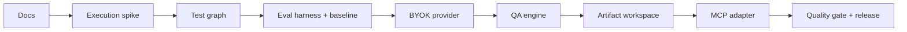

# V1 Checkpoint

Date: 2026-06-14
Baseline: `main` at `bd36f90`
Architecture: [Verification Intelligence Architecture](superpowers/specs/2026-06-14-verification-intelligence-architecture-design.md)

## Headline

The engineering foundation and safe repository scanner are complete. The V1
verification planning engine is not implemented. Current MCP tools prove protocol
and schema mechanics but still represent the superseded public five-stage design.

## Current Reality

| Area | Status | Reality |
| --- | --- | --- |
| Engineering gate | Done | Biome, typecheck, build, tests, commitlint, Dependabot |
| MCP stdio adapter | Done foundation | Starts and validates calls; public tool shape must change |
| Safe repo scanner | Done foundation | Strong confinement, exclusions, limits, evidence index |
| Existing QA schemas | Partial | Useful concepts; not yet execution-ready test graph |
| QA engine | Pending | No provider calls, workflow, semantic review, or repair |
| BYOK providers | Pending | No provider adapters or configuration |
| Artifact persistence | Pending | Paths only; no atomic canonical writer |
| Comparative evals | Pending | No generation-quality corpus or release threshold |
| Released execution | Later | V2, intentionally outside V1 |

The product currently cannot generate a real QA plan.

## Verified Foundation

- pnpm/Turborepo TypeScript monorepo.
- MCP SDK stdio server with injected handlers and protocol tests.
- Zod validation at tool boundaries.
- Safe scanner with symlink avoidance, hard secret exclusions, `.gitignore`, byte
  and traversal limits, truncation metadata, and deterministic evidence paths.
- 127 tests passed at the architecture review checkpoint: 107 scanner tests and
  20 MCP tests.
- CI build, typecheck, lint, tests, and commit message checks passed.

## Architecture Delta

The accepted architecture changes the implementation direction:

- Product core: verification intelligence and durable test graph.
- V1 reasoning: owned model workflow through local BYOK.
- Public API: coarse create/refine/get plan operations.
- Internal flow: ingest, contextualize, model requirements, plan, semantic review,
  deterministic validation, repair, persist.
- Package strategy: deepen `core`, `planner`, and `artifacts` into one QA engine;
  retain the scanner as a substantial independent module.
- V1 release: planning only, but execution-ready schema.
- V1 moat/release gate: comparative generation evals.
- Learning step: disposable local API execution spike before planning polish.

## Workstreams

### 1. Architecture and Canonical Docs

Status: done when this checkpoint is committed.

- Final architecture specification.
- ADRs for accepted and rejected directions.
- V1 scope aligned to planning-first BYOK engine.
- Old architecture review marked as deliberation history.

### 2. Execution Risk Spike

Status: pending.

Timebox: one day. Use a local fixture API and one hand-written failing test.

Exit criteria:

- allowlisted local target only;
- request/response/assertion/timing/process output captured;
- coherent failure bundle produced;
- non-allowlisted target rejected;
- findings documented; spike may be deleted.

### 3. Execution-Ready Test Graph

Status: pending.

Deepen existing domain contracts into a versioned graph:

- project, plan, source, evidence, requirement, feature, case, step, assertion,
  data requirement, open question, and generation metadata;
- stable IDs and explicit coverage links;
- structured targets, actions, assertions, data, and cleanup intent;
- canonical JSON, Markdown rendering, and migrations.

Exit criteria: fixtures round-trip through schema and Markdown without losing
identity, provenance, or execution-relevant information.

### 4. Eval Harness and Baseline

Status: harness complete; release thresholds pending calibration.

Implemented in `packages/evals` as a reference-based, deterministic harness
([ADR-0009](adr/0009-reference-based-deterministic-eval.md),
[plan](superpowers/plans/2026-06-15-eval-harness-and-baseline.md)):

- 8 calibrated fixtures (UI form, authz API, stateful/idempotent, integration
  failure, contradictory spec, evidence conflict, adversarial shallow, unsupported
  assumptions), each with raw-model / host-only / qa-engine arms.
- Weighted rubric over nine quality dimensions plus separate Hard-Fail gates.
- `validateTestGraph` reused for deterministic Test Graph validation in scoring.
- `pnpm eval` produces a byte-stable `results.json` + Markdown report and compares
  to an accepted baseline; baseline committed under `test/fixtures/baseline`.

Remaining before release (workstream #9): replace hand-authored synthetic tiers
with real recorded raw-model/host-only baselines, and record real release
thresholds (the calibration commit) before any prompt tuning.

Exit criteria: one command produces comparable, versioned eval results. **Met** —
`pnpm eval` is deterministic, byte-stable, and gates on regression.

### 5. BYOK Provider Seam

Status: pending.

- Local provider/model configuration.
- First real provider adapter.
- Structured generation, timeout/cancellation, usage metadata.
- Typed auth/quota/transient/invalid-output errors.
- Secret-safe logs and bounded retry/token policies.

Exit criteria: deterministic fake provider and one real provider both satisfy the
same engine-facing contract.

### 6. QA Engine

Status: pending.

- Coarse `createPlan`, `refinePlan`, and `loadPlan` operations.
- Versioned prompts and methodology.
- Safe context packaging from spec, diff, selected files, and scanner evidence.
- Internal requirement, planning, semantic-review, deterministic-validation,
  bounded-repair, and persistence stages.

Exit criteria: real input produces a valid persisted plan through one engine call;
callers never orchestrate internal stages.

### 7. Artifact Workspace

Status: pending.

- Root-confined plan paths.
- Atomic JSON writes and read-back validation.
- Generated Markdown.
- Optimistic version conflict handling.
- Non-secret generation metadata.

Exit criteria: interruption or concurrent refinement cannot silently corrupt or
overwrite a plan.

### 8. MCP Product Adapter

Status: pending.

- Replace five stage tools with create/refine/get operations.
- Progress and cancellation.
- Typed domain-to-MCP errors.
- MCP roots/project-root policy.
- End-to-end tests through stdio.

Exit criteria: supported host can install the MCP server and create/refine a real
plan using local BYOK configuration.

### 9. Quality Gate and Release

Status: pending.

- Run comparative evals against recorded baselines.
- Confirm quality, unsupported-claim, latency, cost, and failure thresholds.
- Test install/config/error flows.
- Publish limitations and security model.

Exit criteria: all [V1 definition-of-done](v1-mvp.md#definition-of-done) items pass.

## Recommended Order

Graph and eval work precedes prompt tuning. Otherwise we would optimize against an
unstable contract without a measurable target.

## Main Risks

| Risk | Control |
| --- | --- |
| V1 becomes a prompt wrapper | Own workflow, graph, validation, artifacts, evals |
| Plans look comprehensive but invent behavior | Evidence links, assumption labels, unsupported-claim metric |
| Execution-ready schema overfits future runner | Use behavioral targets/assertions, not Playwright implementation details |
| Provider differences leak through engine | Normalize provider capabilities/errors behind adapters |
| Scanner consumes effort without improving plans | Freeze breadth; require eval evidence for expansion |
| Planning V1 becomes destination | Keep V2 graph entities and execution spike; no V1 execution scope creep |
| Package count recreates shallow modules | One deep QA engine until multiple real consumers justify splits |

## Explicitly Later

- Playwright/API generation and local execution.
- Failure evidence and diagnosis loop.
- Cloud workers/control plane/database.
- Dashboard, schedules, teams, billing, and CI/PR gates.
- Automatic repair patches.
