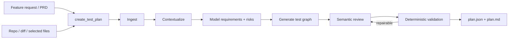

# V1 MVP: Verification Planning Engine

Date: 2026-06-14
Status: accepted
Architecture: [Verification Intelligence Architecture](superpowers/specs/2026-06-14-verification-intelligence-architecture-design.md)

## Position

V1 is a local, BYOK verification planning engine used first through MCP. It turns
feature intent and repository evidence into a traceable, execution-ready test
plan for engineers, QA, and coding agents.

V1 is not a hosted QA platform and does not execute tests. It is also not a thin
Skill or host-model wrapper: we own the model workflow, methodology, schema,
semantic review, deterministic validation, artifacts, and evaluation corpus.

## User Promise

Given a feature request or spec plus a local repository, V1 produces a plan that:

- identifies requirements, assumptions, unknowns, and risks;
- connects requirements to source and code evidence;
- proposes useful positive, negative, edge, security, regression, and integration
  cases;
- states machine-checkable targets, actions, data, and assertions;
- is measurably better than using the same model with a raw prompt;
- can become runnable tests in V2 without a domain-model rewrite.

## Core Workflow



The stages are internal. MCP callers invoke coarse operations and never pass
large intermediate objects between tools.

## Included

- MCP adapter for local coding-agent hosts.
- `create_test_plan`, `refine_test_plan`, and `get_test_plan` operations.
- BYOK provider configuration and explicit model selection.
- Inputs from feature text, PRD/spec text, selected documents, repo path, relevant
  files, git diff/branch context, existing tests, and user hints.
- Safe bounded repository evidence collection.
- Requirement normalization, feature/risk mapping, case generation, independent
  semantic review, deterministic validation, and bounded repair.
- Versioned test graph with stable IDs and source traceability.
- Canonical JSON and generated Markdown artifacts.
- Comparative eval suite and release threshold.

## Excluded

- Released browser or API execution.
- Playwright/Python test generation.
- Cloud runtime, dashboard, database, schedules, billing, teams, or CI gates.
- Production URL/API probing.
- Automatic source-code patching.
- Hosted model billing or model fine-tuning.

## BYOK

Users supply provider credentials locally. V1 owns the reasoning workflow but not
model billing.

Requirements:

- keys come from environment variables or local secret references;
- keys never enter prompts, logs, telemetry, or artifacts;
- provider/model selection is explicit per project or invocation;
- authentication, quota, transient, timeout, and invalid-output errors are
  distinct;
- retries and token/wall-clock budgets are bounded;
- provider adapters normalize structured generation and usage metadata.

Initial support may ship one provider at a time, but the architecture supports
multiple BYOK providers as a real product requirement.

## Inputs

- Free-form feature request.
- PRD/spec/Markdown/document text.
- Optional target URL as planning context only.
- Optional OpenAPI/Postman/free-form API documentation as planning context only.
- Local repository root.
- Branch, commit, or diff context.
- Explicitly relevant files and existing tests.
- User hints: roles, flows, risks, exclusions, and known constraints.
- Existing plan plus feedback for refinement.

## Test Graph Output

### Requirements

- Stable ID and statement.
- Functional/security/state/integration/etc. kind.
- Explicit, inferred, or assumption strength.
- Priority and risk.
- Source/evidence links.
- Open questions and blockers.

### Features

- Feature and sub-feature.
- User flow and actor.
- Screens, routes, endpoints, data stores, and dependencies.
- Requirement links and risk level.

### Test Cases

- Stable ID, title, objective, type, priority, and risk rationale.
- Covered requirement IDs and quality-category tags.
- Actor/role and authentication state.
- Structured target: UI, API, integration, or generic behavior.
- Structured preconditions and reusable test-data requirements.
- Ordered actions with target and input.
- Typed assertions with subject, matcher, expected result, and observation point.
- Postconditions and cleanup intent.
- Evidence links.
- Automation readiness and blockers.

## Quality Bar

Plans consider, when relevant:

- happy path and alternate valid paths;
- missing, malformed, and boundary inputs;
- roles, authorization, authentication, and information leakage;
- state transitions, concurrency, retries, duplicate submission, and idempotency;
- existing/new/stale/deleted data;
- UI loading, empty, error, refresh, timeout, and navigation states;
- API/UI/data consistency;
- integration success, failure, timeout, and partial rollback;
- observability of each assertion;
- cleanup requirements and environment blockers.

The engine must not create cases merely to satisfy every category. Relevance,
risk, and evidence matter more than checklist volume.

## Artifacts

```text
.test-framework/
  project.json
  plans/<plan-id>/
    plan.json
    plan.md
    generation.json
```

- `plan.json` is canonical.
- `plan.md` is derived and regenerable.
- `generation.json` records non-secret versions, fingerprints, usage, and warnings.
- Writes are root-confined, atomic, version-checked, and schema-validated.

## Evaluation and Release Gate

V1 differentiation depends on measured planning quality. Release requires:

- deterministic contract and safety tests passing;
- representative generation fixtures across multiple product shapes;
- same-model comparison against raw prompting and host-only generation;
- expert-calibrated rubric covering requirement recall, unsupported claims,
  traceability, risk coverage, duplicates, assertion quality, evidence accuracy,
  and execution readiness;
- a recorded threshold set before release evaluation;
- no material regression in unsupported claims, latency, or failure rate.

## Execution Spike

Before substantial V1 polish, spend at most one day proving a hand-written API
test can run against a local allowlisted fixture and produce a coherent failure
bundle. This is research, not V1 product scope. It validates the V2 evidence path
without importing execution complexity into V1.

## Definition of Done

V1 is done when:

1. A user configures a supported BYOK provider locally.
2. One MCP operation creates a persisted plan from real spec and repo context.
3. The engine performs internal semantic review and deterministic validation.
4. The output is traceable, editable, execution-ready, and safe to commit.
5. Refinement updates a plan without losing stable identities or provenance.
6. Comparative evals beat the recorded raw-model baseline.
7. Installation, configuration, errors, and limitations are documented.

## Beyond V1

- V2: generate portable UI/API tests, run locally, capture evidence, classify
  failures, and rerun selected tests.
- V3: managed cloud execution, durable history, schedules, CI/PR gates, teams,
  billing, and dashboard workflows.
